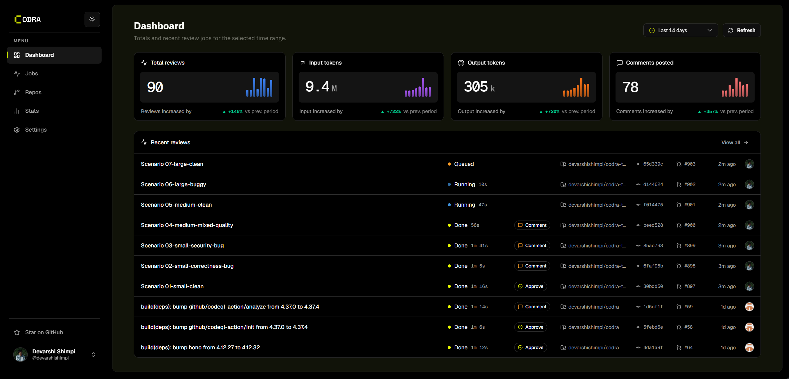

  <h1>Codra</h1>

  

    Self-hosted AI code review for GitHub pull requests. 
    Cloudflare-native, queue-backed, repository-aware, and built for teams that want to own their review engine.
  

  

    
    
    
    
  

  

    <a href="https://codra.run">Website</a>
    |
    <a href="https://codra.run/docs">Docs</a>
    |
    <a href="https://codra.run/docs/installation">Installation</a>
    |
    <a href="https://github.com/devarshishimpi/codra/issues">Issues</a>
    |
    <a href="CONTRIBUTING.md">Contributing</a>
  

Codra listens to GitHub pull request events, runs AI-powered review jobs, posts inline findings back to the PR, and gives you a dashboard to inspect jobs, repositories, model routing, review history, and failed queue runs.

> **Beta** - Codra is under active development. Expect rough edges, missing features, and breaking changes between releases. Feedback and bug reports are welcome via [GitHub Issues](https://github.com/devarshishimpi/codra/issues).

## Why Codra

- **Own the whole review loop**: Run the GitHub App, Cloudflare Worker, queue, database, model credentials, and dashboard under your own control.
- **Review with repository context**: Codra checks pull request diffs for correctness, security, performance, maintainability, and repo-specific patterns.
- **Configure each repository**: Tune triggers, skipped paths, draft handling, mention reviews, labels, custom rules, and review budgets from the dashboard.
- **Route models deliberately**: Use global defaults, per-repo model chains, fallbacks, and size-based overrides for larger pull requests.
- **Operate the system**: Inspect job history, PR findings, webhook deliveries, model usage, and dashboard stats.

## Features

- Automatic reviews on `opened`, `synchronize`, `ready_for_review`, and `reopened` pull request events
- Mention-triggered reviews for on-demand analysis
- Inline GitHub review comments plus summary reviews and check run updates
- Queue-backed processing through Cloudflare Queues
- GitHub OAuth dashboard authentication
- External PostgreSQL storage through Cloudflare Hyperdrive
- Dashboard-managed LLM providers for OpenAI, OpenRouter, Anthropic, Google, NVIDIA, and Cloudflare models
- Repository settings for labels, skipped globs, custom rules, and model routing

## How It Works

1. GitHub sends Codra a pull request webhook.
2. Codra verifies the signature and loads repository review settings.
3. A review job is stored in PostgreSQL and queued on Cloudflare Queues.
4. The Worker consumes the job, fetches the PR diff, runs model review passes, and formats findings.
5. Codra posts inline comments and a summary review back to GitHub.
6. The dashboard keeps the job history, findings, logs, and stats available for operators.

## Stack

- **Worker**: Cloudflare Workers, Hono, Wrangler
- **Dashboard**: React, Vite, Tailwind CSS, Radix UI, Recharts
- **Data**: PostgreSQL, Cloudflare Hyperdrive, Cloudflare KV
- **Queues**: Cloudflare Queues and Workflows
- **Models**: OpenAI, OpenRouter, Anthropic, Google, NVIDIA, and Cloudflare providers
- **GitHub**: GitHub App webhooks, checks, reviews, and OAuth
- **Quality**: TypeScript, Zod, Vitest, Playwright browser tests

## Documentation

The full setup and operations guides live at [codra.run/docs](https://codra.run/docs).

- [Installation guide](https://codra.run/docs/installation)
- [Configuration guide](https://codra.run/docs/configuration)
- [Deploy with Neon](https://codra.run/docs/neon)
- [Deploy with Railway](https://codra.run/docs/railway)
- [Contributing](CONTRIBUTING.md)
- [Security policy](SECURITY.md)

## Contributing

Contributions are welcome. Please read [CONTRIBUTING.md](CONTRIBUTING.md) before opening a pull request against `dev`. Codra uses a Contributor License Agreement for contributions.

## License

Codra is licensed under the [GNU Affero General Public License v3.0](LICENSE).
